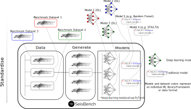

|

Welcome to SeisBench
=====================================

SeisBench is an open-source python toolbox for machine learning in seismology.
It provides a unified API for applying deep learning models to seismic waveforms,
and for accessing and training machine learning algorithms on seismic datasets.
SeisBench has been built to alleviate traditional bottlenecks when applying
machine learning techniques to seismic data, in particular the steps of data
preparation, collection and labelling. At the same time it aims to foster
interoperability, interchangeability and comparability of different models and datasets.

|

To learn more about the dataset API, including the datasets currently integrated see :ref:`benchmark_datasets`.
If you would like to know more about how to apply, build, and train models,
along with information on the machine learning models readily available through *SeisBench*, see :ref:`model_overview`.
For an extensive reference of all features, check the code :ref:`documentation_overview`.

SeisBench is built to be extensible and modular, allowing for easy incorporation of new models
and datasets. Users are explicitly encouraged to contribute, as any future iterations will
be based of community feedback.

.. admonition:: Citation...

   Please cite any work in which SeisBench was used:

      Woollam, J., Münchmeyer, J., Tilmann, F., Rietbrock, A., Lange, D., Bornstein, T., Diehl, T., Giuchi, C., Haslinger, F.,
      Jozinović, D., Michelini, A., Saul, J., & Soto, H. (2022). SeisBench - A Toolbox for Machine Learning in Seismology. in *Seismological Research Letters*
      https://doi.org/10.1785/0220210324

      The pre-print is also available for those who don't have access:
      https://arxiv.org/abs/2111.00786,

.. toctree::
   :maxdepth: 2
   :hidden:

   self
   pages/installation_and_usage.rst
   pages/examples.rst
   pages/data/overview.rst
   pages/models/overview.rst
   pages/contributing.rst
   pages/documentation/overview.rst

Indices and tables
==================

* :ref:`genindex`
* :ref:`modindex`
* :ref:`search`
