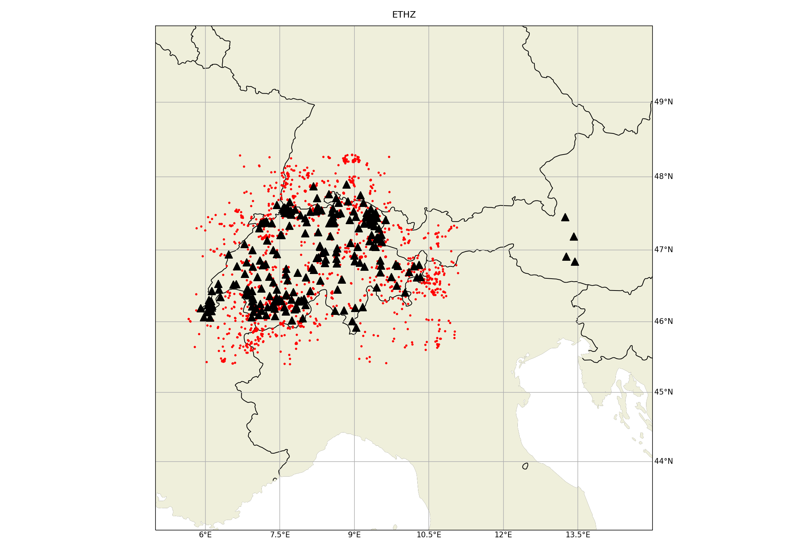
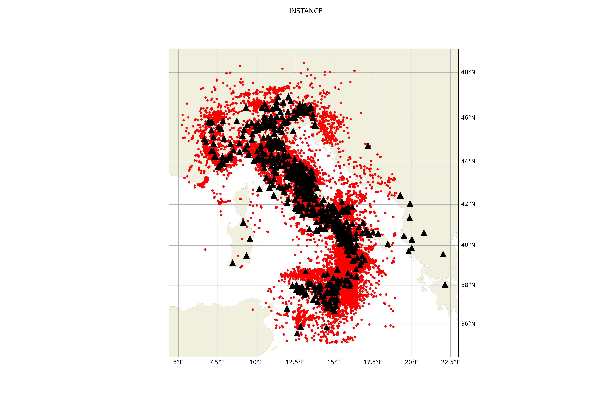
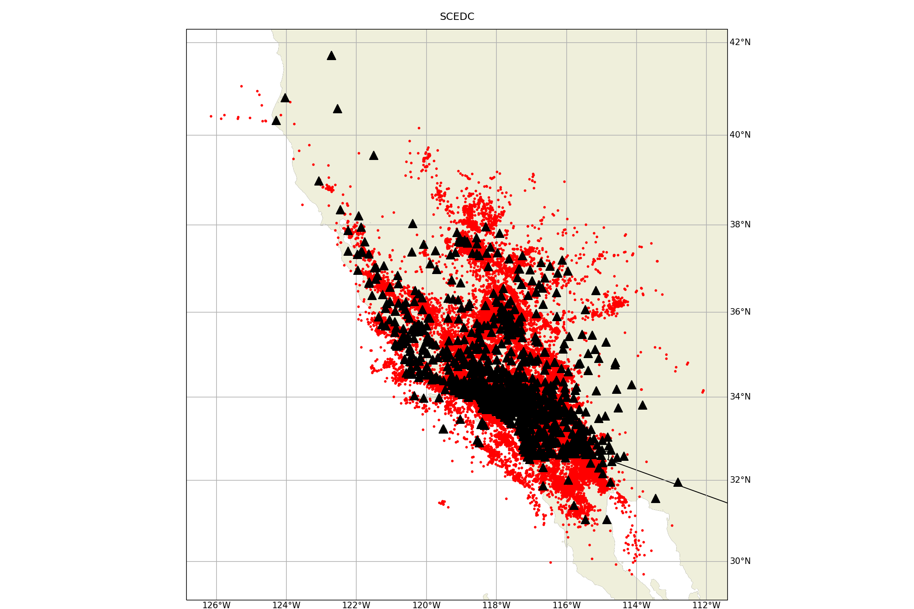
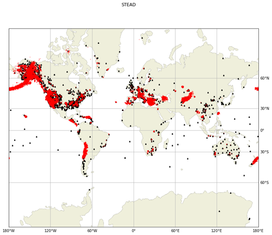

.. _benchmark_datasets:

Benchmark Datasets
=====================

SeisBench facilitates the downloading of a suite of publicly available seismic waveform datasets
for training of machine learning algorithms. An overview of the contents of each dataset is below,
along with the corresponding citation.

ETHZ
-----

The :py:class:`~seisbench.data.ethz.ETHZ` benchmark dataset contains regional recorded seismicity on publicly available networks
throughout the Switzerland region. For more information see: `SED website
<http://www.seismo.ethz.ch/en/research-and-teaching/products-software/waveform-data/>`__.

Dataset contains 36,743 waveform examples.

.. warning::

    Dataset size: waveforms.hdf5 **~22Gb**, metadata.csv **~13Mb**.

.. admonition:: Citation
   
    Each individual network has its own DOI. From publicly available data:

    * CH: https://doi.org/10.12686/sed/networks/ch
    * C4: https://doi.org/10.12686/sed/networks/c4
    * 8D: https://doi.org/10.12686/sed/networks/8d
    * S:  https://doi.org/10.12686/sed/networks/s
    * XT: https://doi.org/10.12686/alparray/xt_2014

GEOFON
------
.. admonition:: Citation

    *citation*

INSTANCE
--------

The INSTANCE benchmark dataset is a dataset of signals comiled by the Istituto Nazionale di Geofisica e Vulcanologia
(INGV). Containing ~1.2 million 3C waveform traces, which record ~50,000 earthquakes and include ~130,000 noise traces.
Magnitude scale of events ranges from 0 - 6.5.
The dataset is split for ease of use into Noise examples :py:class:`~seisbench.data.instance.InstanceNoise`,
waveform examples in counts :py:class:`~seisbench.data.instance.InstanceCounts`, and waveform examples in
ground motion units :py:class:`~seisbench.data.instance.InstanceGM`. A combined dataset containing the noise examples
and waveform examples as counts is also available :py:class:`~seisbench.data.instance.InstanceCountsCombined`.

.. warning::

    Dataset size:

    * waveforms (counts) **~160Gb**
    * waveforms (ground motion units) **~310Gb**

.. admonition:: Citation
   
    Michelini, A., Cianetti, S., Gaviano, S., Giunchi, C., Jozinović, D., & Lauciani, V. (2021).
    INSTANCE - The Italian Seismic Dataset For Machine Learning.
    Istituto Nazionale di Geofisica e Vulcanologia (INGV).
   
    https://doi.org/10.13127/INSTANCE

LENDB
-----

The :py:class:`~seisbench.data.lendb.LENDB` dataset is a published benchmark dataset (see citation below) of local
earthquakes recorded across a global set of 3-component seismic stations. The entire dataset comprisis ~1.25 million
waveform examples, recorded on 1487 individual 3-component stations. There are ~305,000 local earthquake examples and
~618,000 noise examples. For more information regarding the benchmark dataset, please refer to the original reference
below.

.. warning::

    Dataset size: waveforms.hdf5 **~20Gb**, metadata.csv **~218Mb**

.. admonition:: Citation

    Magrini, Fabrizio, Jozinović, Dario, Cammarano, Fabio, Michelini, Alberto, & Boschi, Lapo. (2020). LEN-DB - Local
    earthquakes detection: a benchmark dataset of 3-component seismograms built on a global scale.

    *  Data set: http://doi.org/10.5281/zenodo.3648232"
    *  Paper: https://doi.org/10.1016/j.aiig.2020.04.001

NEIC
----

The National Earthquake Information Centre (NEIC) benchmark dataset comprises ~1.3 million seismic phase arrivals with 
global source-station paths. As information on the trace start-time and station information is missing for this dataset, 
it is stored in the SeisBench format, but without this normally required information

.. admonition:: Citation

    Yeck, W. L., Patton, J. M., Ross, Z. E., Hayes, G. P., Guy, M. R., Ambruz, N. B., Shelly, D. R., Benz, H. M., Earle, P. S., (2021)
    Leveraging Deep Learning in Global 24/7 Real-Time Earthquake Monitoring at the National Earthquake Information Center.
    
    https://doi.org/10.1785/0220200178

SCEDC
-----

The :py:class:`~seisbench.data.scedc.SCEDC` benchmark dataset contains all publicly available recordings
of seismic events in the Southern Californian Seismic Network, which were manually picked, from
2000-2020. Contains ~8,100,000 waveform examples.

.. warning::

    Dataset size: waveforms.hdf5 **~660Gb**, metadata.csv **~2.2Gb**

.. admonition:: Citation

   SCEDC (2013): Southern California Earthquake Center.
   
   https://doi.org/10.7909/C3WD3xH1

STEAD
-----

The :py:class:`~seisbench.data.stead.STEAD` dataset is a published benchmark dataset (see citation below) of local seismic signals -
both earthquake and non-earthquake - along with noise examples. In total there are ~1.2 million time series, of which ~100,000
are noise examples and the remaining contain seismic arrivals. 450,000 earthquakes are contained in the datasets.

.. warning::

    Dataset size: waveforms.hdf5 **~70Gb**, metadata.csv **200Mb**

.. admonition:: Citation

    Mousavi, S. M., Sheng, Y., Zhu, W., Beroza G.C., (2019). STanford EArthquake Dataset (STEAD):
    A Global Data Set of Seismic Signals for AI, IEEE Access.
   
    https://doi.org/10.1109/ACCESS.2019.2947848

