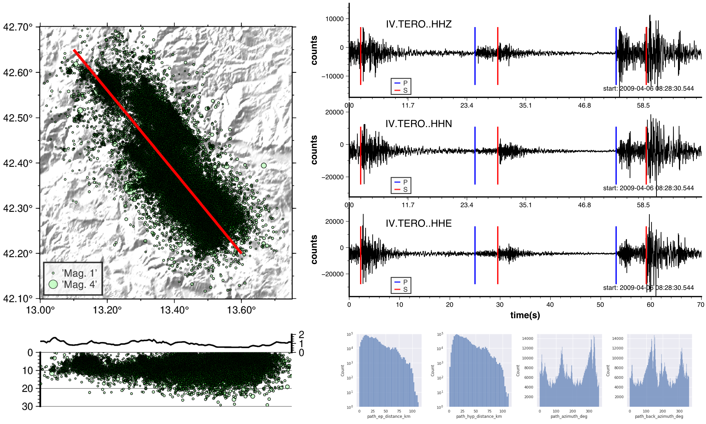
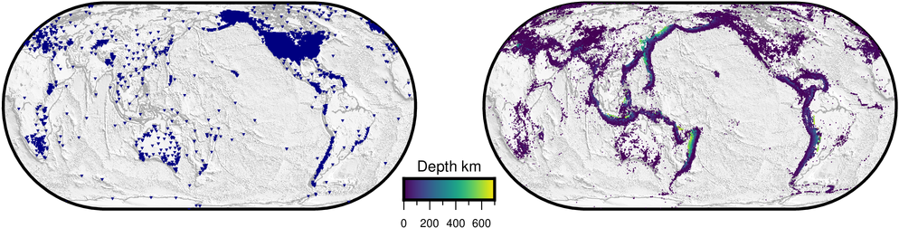
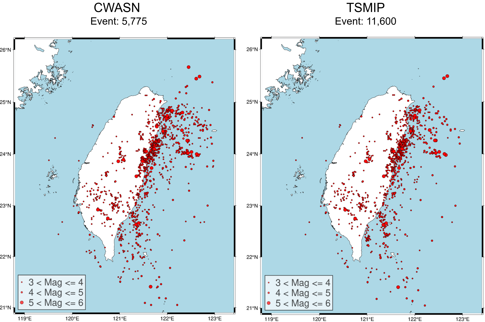
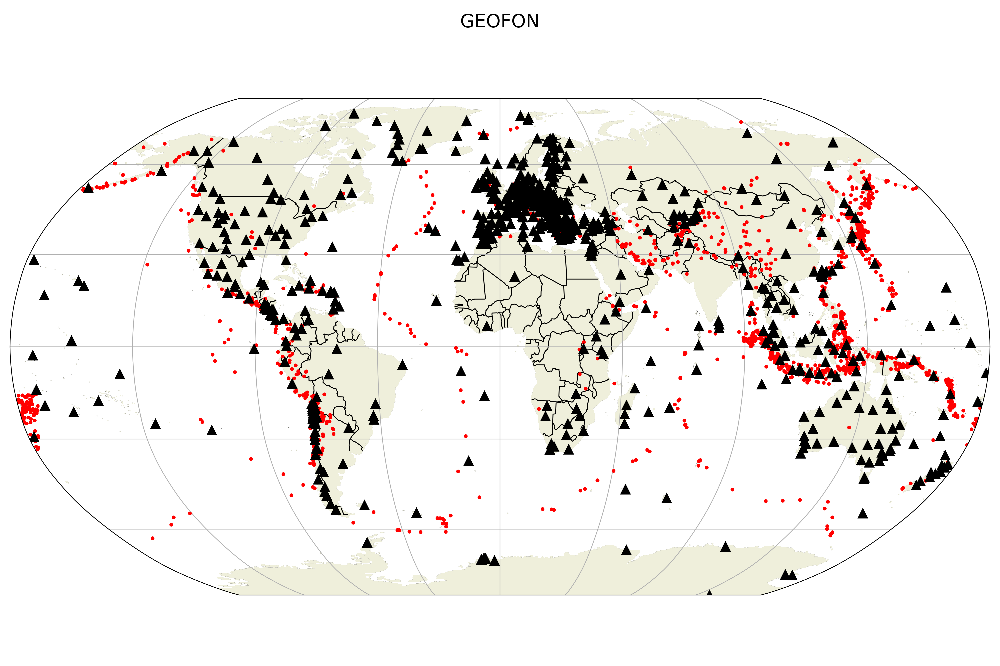
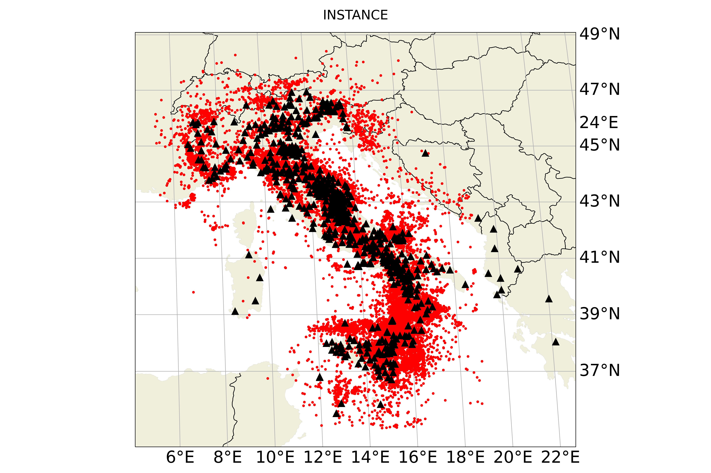
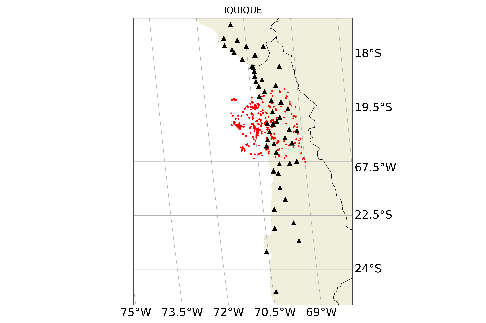
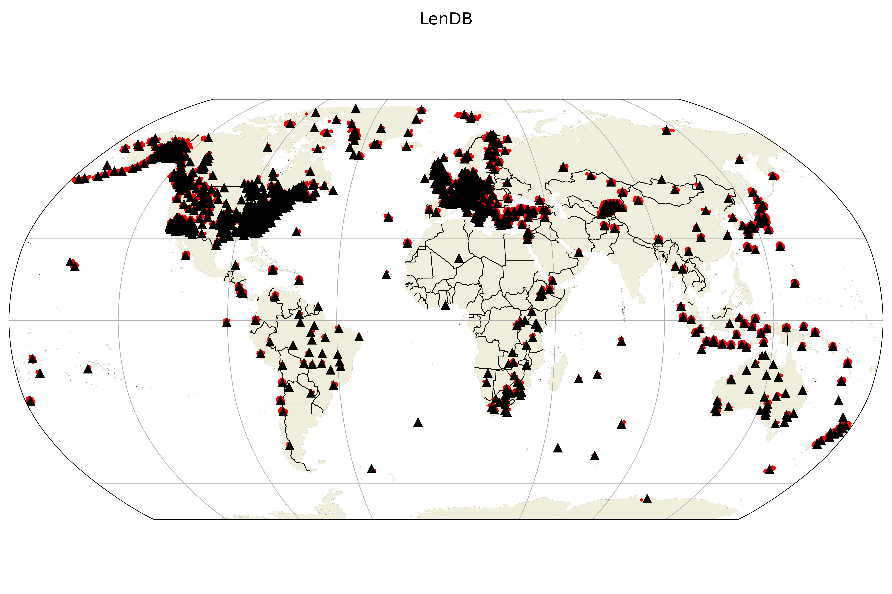
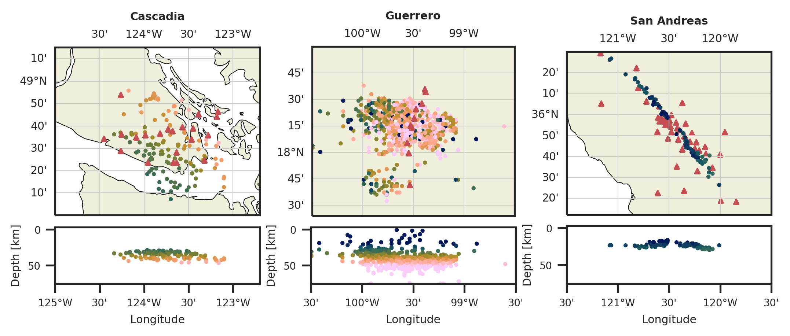
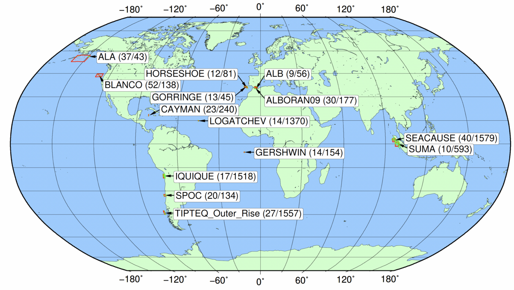
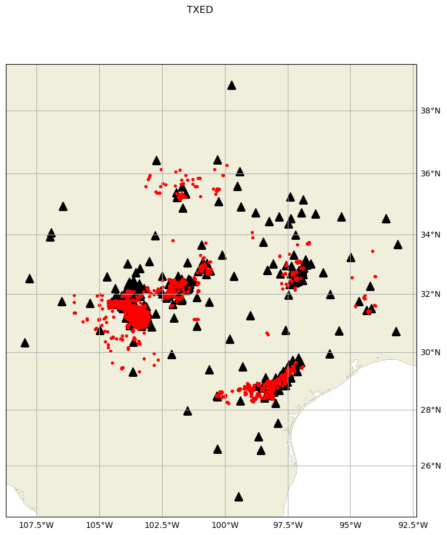

.. _benchmark_datasets:

Benchmark Datasets
==================

SeisBench facilitates the downloading of a suite of publicly available seismic waveform datasets
for training of machine learning algorithms. An overview of the contents of each dataset is below,
along with the corresponding citation.

AQ2009
------

The :py:class:`~seisbench.data.aq2009.AQ2009` dataset contains
the aftershock sequence of the 2009 L'Aquila earthquake (6.1 Mw),
a seismic event of significant impact and damage in the South-Central Apennines
region. This dataset serves as a valuable resource for aftershock characterization
using Machine Learning (ML) approaches. For more information see Valoroso et al. (2013): https://doi.org/10.1002/jgrb.50130

The dataset contains:
 * 254 days of aftershocks (2009-04-06 up to 2009-12-20).
 * 63,704 earthquakes.
 * 1,258,006 3-component traces cut of 70 seconds.
 * Absolute (HypoEllipse) and relative (HypoDD) locations.
 * 3 seismic networks (MN, IV, XJ) for a total of 67 stations.
 * Multiple P and S pick arrivals (up to 8 per cut) that allow improvements in current Machine Learning algorithms development and analysis.
 * 201 metadata fields providing information on the station, trace, source, path, and data quality.
 * Waveforms and metadata information on both digital units and ground motion.

Depending on user needs and case study, the dataset can be accessed using the following classes:
:py:class:`~seisbench.data.aq2009.AQ2009Counts` to upload waveforms in digital units.
:py:class:`~seisbench.data.aq2009.AQ2009GM` to upload waveforms in ground motion (with instrument response removed)

.. warning::

    Dataset size: waveforms.hdf5 **~123Gb**, metadata.csv **~1.7Gb**. The
    size refers to both counts and ground motion datasets individually.

    Each individual network has its own DOI. From publicly available data:

    * IV: https://doi.org/10.13127/SD/X0FXnH7QfY
    * MN: https://doi.org/10.13127/SD/fBBBtDtd6q
    * XJ: https://doi.org/10.15778/RESIF.XJ2009

.. admonition:: Citation

    Bagagli, M., Valoroso, L., Michelini, A., Cianetti, S.,
    Gaviano, S., Giunchi, C., Jozinović, D., & Lauciani, V. (2023).
    AQ2009 - The 2009 Aquila Mw 6.1 earthquake aftershocks seismic
    dataset for machine learning application.
    Istituto Nazionale di Geofisica e Vulcanologia (INGV).

    https://doi.org/10.13127/AI/AQUILA2009

Bohemia
--------

.. figure::  _static/bohemia_dataset.webp
   :align:   center

The :py:class:`~seisbench.data.bohemia.BohemiaSaxony` dataset provides 24,821 local earthquake recordings from the NW Bohemia/Vogtland region (Germany / Czech Republic). The seismicity in the region is characterized by intense earthquake swarms of small magnitudes. The signal quality is crisp due to low noise in the region and competent Variscian rock with small sediment overlay. The data was collected from 72 seismic stations between September 2009 and December 2024.

Dataset details:

    * Stations: 72, three-component stations; broadband and short-period sensors.
    * Sampling Rate 100 Hz.
    * Events: 24,821 local earthquakes, magnitude range from Ml -1.3 to Ml 3.8.
    * Quality: The dataset is characterized by a high pick quality and a low magnitude of completeness (Mc ~0.8).
    * Time Period: September 2009 - December 2024
    * Manually picked P and S arrivals. Analyzed by a single operator (Dr. S. Wendt) at the Geophysical Observatory of University of Leipzig Collm, ensuring high consistency and quality.
    * Default Split: The dataset is randomly divided into training (80%), validation (10%), and test (10%) sets.

.. warning ::

    This dataset contains restricted data from the West Bohemia Local Seismic Network (WEBNET).
    Therefore, no precompiled version of the dataset is available through SeisBench.
    To compile the full dataset, you will need to provide an EIDA token.
    Please see the `WEBNET site <https://doi.org/10.7914/SN/WB>`_ for more information.

.. admonition:: Citation

    Catalog and Picks:

    * Earthquakes in Saxony (Germany) and surroundings
      from 2006 to 2024 -- onsets and locations,
      https://opara.zih.tu-dresden.de/items/5387886f-25f2-4faf-8dca-33981d898ab9

    Seismic Networks:

    * SXNET Saxon Seismic Network, https://doi.org/10.7914/SN/SX
    * West Bohemia Local Seismic Network (WEBNET), https://doi.org/10.7914/SN/WB
    * Thüringer Seismologisches Netz, https://doi.org/10.7914/SN/TH
    * Czech Regional Seismic Network, https://doi.org/10.7914/SN/CZ

CEED
-----

.. figure::  _static/ceed_overview.png
   :align:   center

The California Earthquake Event Dataset (:py:class:`~seisbench.data.ceed.CEED`),
compiles records from the Northern (NCEDC) and Southern (SCEDC) California Earthquake Data Centers.
The dataset contains waveforms from ~650,000 events for a total of 4.1 million traces.
It covers the years from 1987 to 2023. Each traces contains manually labels P and S arrivals.
In addition, the dataset features rich metadata. Several metadata columns have the suffix ``_list``.
These contain a variable amount of data points and are used, for example, to describe additional phase arrivals in
traces. The dataset comes with a chronological train/dev/test split.
As of now, there is no direct way of using this information in SeisBench, but the information is contained
in the metadata. Further details on how to use the dataset, also without SeisBench, are available on the HuggingFace
site: https://huggingface.co/datasets/AI4EPS/CEED.

.. warning::

    Dataset size: waveforms.hdf5 **~575 Gb**, metadata.csv **~2.1 Gb**.

.. admonition:: Citation

    Zhu, W., Wang, H., Rong, B., Yu, E., Zuzlewski, S., Tepp, G., ... & Allen, R. M. (2025).
    California Earthquake Dataset for Machine Learning and Cloud Computing.
    arXiv preprint arXiv:2502.11500.
    https://arxiv.org/abs/2502.11500

CREW
-----

The :py:class:`~seisbench.data.crew.CREW` dataset, the Curated Regional Earthquake Waveforms Dataset,
which is a dataset of earthquake arrivals recorded at local and regional distances.
CREW was assembled from millions of waveforms with quality control through semi-supervised learning.
CREW includes 1.6 million waveforms that have global coverage.
Each waveform consists of a 5 minute three component seismogram with labels for both a P and S arrival.
CREW provides a high quality labeled waveform data set that can be used to develop and test machine learning
models for the analysis of earthquakes recorded at regional distances.

.. warning::

    Dataset size: waveforms.hdf5 **~1.1Tb**, metadata.csv **~354Mb**.

.. admonition:: Citation

    Aguilar Suarez, A. L., & Beroza, G. (2024).
    Curated Regional Earthquake Waveforms (CREW) Dataset.
    Seismica, 3(1).
    https://doi.org/10.26443/seismica.v3i1.1049

CWA
-----

.. figure::  _static/cwa_stations.png
   :align:   center

The :py:class:`~seisbench.data.cwa.CWA` dataset includes a large number of seismic events, especially high-magnitude.
It is a comprehensive set of events collected by the Central Weather Bureau in Taiwan.
There are two seismographic network: CWASN and TSMIP in the dataset.
The dataset version in SeisBench combines both seismic networks.
The CWA benchmark features over 40 attributes and ~500,000 seismograms,
providing valuable data labels for various seismology-related tasks.
In the future, updated versions of this dataset are planned to ensure its relevance and utility.
For more information see: https://scweb.cwa.gov.tw/en-US

.. warning::

    Dataset size: ~494GB (~177GB of noise samples)

    The tutorial on loading dataset properly is in the dataset cards:

    * Merged-CWA: https://huggingface.co/datasets/NLPLabNTUST/Merged-CWA
    * Merged-CWA-Noise: https://huggingface.co/datasets/NLPLabNTUST/Merged-CWA-Noise

.. admonition:: Citation

    Kuan-Wei Tang, Kuan-Yu Chen, Da-Yi Chen, Tai-Lin Chin, Ting-Yu Hsu.
    The CWA Benchmark: A Seismic Dataset from Taiwan for Seismic Research.
    Seismological Research Letters 2024.
    doi: https://doi.org/10.1785/0220230393

ETHZ
-----

.. figure::  _static/ethz_mapplot.png
   :align:   center

The :py:class:`~seisbench.data.ethz.ETHZ` benchmark dataset contains regional recorded seismicity on publicly available networks
throughout the Switzerland region. For more information see: `SED website
<http://www.seismo.ethz.ch/en/research-and-teaching/products-software/waveform-data/>`__.

Dataset contains 36,743 waveform examples.

.. warning::

    Dataset size: waveforms.hdf5 **~22Gb**, metadata.csv **~13Mb**.

.. admonition:: Citation

    Each individual network has its own DOI. From publicly available data:

    * CH: https://doi.org/10.12686/sed/networks/ch
    * C4: https://doi.org/10.12686/sed/networks/c4
    * 8D: https://doi.org/10.12686/sed/networks/8d
    * S:  https://doi.org/10.12686/sed/networks/s
    * XT: https://doi.org/10.12686/alparray/xt_2014

GEOFON
------

As part of its effort to measure and characterize relevant seismicity world-wide in real time, the GEOFON earthquake monitoring serivce acquires and analyses waveform data of over 800, globally distributed seismic stations.
Besides automatic processing, manual analysis, especially onset re-picking, is performed routinely whenever necessary to improve the location quality.
Usually only few picks are manual re-picked.
However, in order to collect reference picks to improve automatic picking, the P arrivals of some events are comprehensively re-picked by an experienced analyst, irrespective of the presence or quality of automatic picks.
For local and near-regional events also S onsets have been picked and for a small fraction both Pn and Pg are included.
For teleseismic events almost no S onsets have been picked.
Depth phases have been picked occasionally but not comprehensively.
In total, there are ~275,000 waveform examples.
The magnitudes of the events comprising this dataset range from about 2 to 9, with the bulk of the manually picked events being intermediate to large events (M 5-7).
Regional events with smaller magnitudes are mostly in Europe and northern Chile.
The time range covers 2009 to 2013.

.. warning::

    Dataset size: waveforms.hdf5 **~25.8Gb**, metadata.csv **~99Mb**.

.. admonition:: Citation

    *Citation information will be added.*

INSTANCE
--------

The INSTANCE benchmark dataset is a dataset of signals compiled by the Istituto Nazionale di Geofisica e Vulcanologia
(INGV). Containing ~1.2 million 3C waveform traces, which record ~50,000 earthquakes and include ~130,000 noise traces.
Magnitude scale of events ranges from 0 - 6.5.
The dataset is split for ease of use into Noise examples :py:class:`~seisbench.data.instance.InstanceNoise`,
waveform examples in counts :py:class:`~seisbench.data.instance.InstanceCounts`, and waveform examples in
ground motion units :py:class:`~seisbench.data.instance.InstanceGM`. A combined dataset containing the noise examples
and waveform examples as counts is also available :py:class:`~seisbench.data.instance.InstanceCountsCombined`.

.. warning::

    Dataset size:

    * waveforms (counts) **~160Gb**
    * waveforms (ground motion units) **~310Gb**

.. admonition:: Citation

    Michelini, A., Cianetti, S., Gaviano, S., Giunchi, C., Jozinović, D., & Lauciani, V. (2021).
    INSTANCE - The Italian Seismic Dataset For Machine Learning.
    Istituto Nazionale di Geofisica e Vulcanologia (INGV).

    https://doi.org/10.13127/INSTANCE

Iquique
-------

The :py:class:`~seisbench.data.iquique.Iquique` dataset contains 13,400 examples of picked arrivals from
the aftershock sequence following the Mw=8.1 Iquique earthquake occuring in N. Chile in 2014. All stations
are 100Hz, 3-component stations. The waveforms contain examples of earthquakes only.

.. warning::

    Dataset size: waveforms.hdf5 **~5Gb**, metadata.csv **~2.6Mb**

.. admonition:: Citation

    Woollam, J., Rietbrock, A., Bueno, A. and De Angelis, S., 2019.
    Convolutional neural network for seismic phase classification,
    performance demonstration over a local seismic network.
    Seismological Research Letters, 90(2A), pp.491-502.
    https://doi.org/10.1785/0220180312

ISC-EHB Depth Phases
--------------------

.. figure::  _static/isc_ehb_mapplot.png
   :align:   center

The :py:class:`~seisbench.data.isc_ehb.ISC_EHB_DepthPhases` dataset contains 44,106 events and 174,436 traces.
It contains traces with depth phase readings (pP, sP and pwP) from the
`ISC-EHB bulletin <http://www.isc.ac.uk/isc-ehb/>`_.
Additional picks have been annotated on the traces, if they were contained in the bulletin.

.. admonition:: Citation

    Münchmeyer, J., Saul, J., Tilmann, F. (2023).
    Learning the Deep and the Shallow: Deep‐Learning‐Based Depth Phase Picking and Earthquake Depth Estimation.
    Seismological Research Letters.
    https://doi.org/10.1785/0220230187

LENDB
-----

The :py:class:`~seisbench.data.lendb.LENDB` dataset is a published benchmark dataset (see citation below) of local
earthquakes recorded across a global set of 3-component seismic stations. The entire dataset comprisis ~1.25 million
waveform examples, recorded on 1487 individual 3-component stations. There are ~305,000 local earthquake examples and
~618,000 noise examples. For more information regarding the benchmark dataset, please refer to the original reference
below.

.. warning::

    Dataset size: waveforms.hdf5 **~20Gb**, metadata.csv **~218Mb**

.. admonition:: Citation

    Magrini, Fabrizio, Jozinović, Dario, Cammarano, Fabio, Michelini, Alberto, & Boschi, Lapo. (2020). LEN-DB - Local
    earthquakes detection: a benchmark dataset of 3-component seismograms built on a global scale.

    *  Data set: http://doi.org/10.5281/zenodo.3648232
    *  Paper: https://doi.org/10.1016/j.aiig.2020.04.001

LFE stack datasets
------------------

SeisBench contains three datasets with stacked waveforms of low-frequency earthquakes datasets:

- Cascadia (Canada/USA), 1817 stacks, :py:class:`~seisbench.data.lfe_stacks.LFEStacksCascadiaBostock2015`
- Guerrero (Mexico), 11200 stacks, :py:class:`~seisbench.data.lfe_stacks.LFEStacksMexicoFrank2014`
- San Andreas fault (USA), 2306 stacks, :py:class:`~seisbench.data.lfe_stacks.LFEStacksSanAndreasShelly2017`

Note that in addition to the regular pick columns, the datasets contain predicted arrival times
in the `trace_*_predicted_arrival_sample` column.

.. admonition:: Citation

    Münchmeyer, J., Giffard-Roisin, S., Malfante, M., Frank, W., Poli, P., Marsan, D., Socquet A. (2024).
    Deep learning detects uncataloged low-frequency earthquakes across regions. Seismica.

MLAAPDE
-------

.. figure::  _static/mlaapde_mapplot.png
   :align:   center

The :py:class:`~seisbench.data.neic.MLAAPDE` dataset is a global, mostly teleseismic dataset with detailed phase
annotations. It contains 1.9 million phase labels. Most label phases are P arrivals with some labels for detailed
phases.

.. admonition:: Citation

    Cole, H. M., Yeck, W. L., & Benz, H. M. (2023). MLAAPDE: A Machine Learning Dataset for Determining
    Global Earthquake Source Parameters. Seismological Research Letters, 94(5), 2489-2499.
    https://doi.org/10.1785/0220230021

    Cole H. M. and W. L. Yeck, 2022, Global Earthquake Machine Learning Dataset:
    Machine Learning Asset Aggregation of the PDE (MLAAPDE): U.S. Geological Survey data release.
    https://doi.org/10.5066/P96FABIB

NEIC
----

The National Earthquake Information Centre (NEIC) benchmark dataset comprises ~1.3 million seismic phase arrivals with
global source-station paths. As information on the trace start-time and station information is missing for this dataset,
it is stored in the SeisBench format, but without this normally required information.

.. warning::

    The NEIC dataset has been superseded by the more comprehensive MLAAPDE dataset. Unless you are aiming for exact
    comparison to previous work, we recommend using the MLAAPDE dataset instead. This dataset is larger and contains
    more comprehensive metadata.

.. admonition:: Citation

    Yeck, W. L., Patton, J. M., Ross, Z. E., Hayes, G. P., Guy, M. R., Ambruz, N. B., Shelly, D. R., Benz, H. M., Earle, P. S., (2021)
    Leveraging Deep Learning in Global 24/7 Real-Time Earthquake Monitoring at the National Earthquake Information Center.

    https://doi.org/10.1785/0220200178

OBS
---

The ocean-bottom seismometer (OBS) benchmark dataset (:py:class:`~seisbench.data.obs.OBS`) comprises ~110,000 seismic waveforms with ~150,000 manually
labeled phase arrivals. The data comprises 15 deployments with a total of 355 stations across different tectonic
settings.

.. admonition:: Citation

    Bornstein, T., Lange, D., Münchmeyer, J., Woollam, J., Rietbrock, A., Barcheck, G., Grevemeyer, I., Tilmann, F. (2023).
    PickBlue: Seismic phase picking for ocean bottom seismometers with deep learning. Earth and Space Science.

    http://doi.org/10.1029/2023EA003332

OBST2024
--------

.. figure::  _static/obst2024_mapplot_small.jpeg
   :align:   center

The OBST dataset (:py:class:`~seisbench.data.obst2024.OBST2024`) comprises ~60,000 seismic waveforms
from ocean-bottom seismometers (OBS). These split into ~35,000 earthquake waveforms and ~25,000 noise waveforms.
For each earthquake waveforms, P and S arrival times have been annotated.
The data comprises 11 deployments across different tectonic settings.

.. admonition:: Citation

    Niksejel, A. and Zhang, M. (2024).
    OBSTransformer: a deep-learning seismic phase picker for OBS data using automated labelling and transfer learning.
    Geophysical Journal International.

    https://doi.org/10.1093/gji/ggae049.

PiSDL
--------

.. figure::  _static/pisdl.png
   :align:   center

The :py:class:`~seisbench.data.pisdl.PiSDL` benchmark dataset contains induced earthquakes from the Dawson-Septimus
area in Canada caused by hydraulic-fracturing-based fluid injection, geothermal induced earthquakes from Insheim
(Germany), St. Gallen (Switzerland), Vendenheim (France), induced earthquakes due to coal mine flooding the in Ruhr area
(Germany), and all available low magnitude events (M_L <= 2) from the Swiss Seismological Service (SED) between 2009 and
2023. The dataset contains 142,001 three component earthquake waveforms.

The full dataset can be loaded by using ``sbd.PiSDL()``. Afterwards, sub datasets can be selected using the
``get_[region]_subset()`` functions.

.. code-block:: python

    import seisbench.data as sbd

    dataset = sbd.PiSDL()

    # Data from the Dawson-Septimus area
    dawson = dataset.get_dawson_septimus_subset()
    # Data from Insehim
    insheim = dataset.get_insheim_subset()
    # Data from St. Gallen
    st_gallen = dataset.get_st_gallen_subset()
    # Data from Switzerland
    switzerland = dataset.get_switzerland_subset()
    # Data from the Ruhr area
    floodrisk = dataset.get_floodrisk_subset()
    # Data from Vendenheim
    vendenheim = dataset.get_vendenheim_subset()

.. warning::

    Dataset size:

    * waveforms (counts) **~35Gb**

.. admonition:: Citation

    Heuel J., Maurer V., Frietsch M., Rietbrock A. (2025).
    Picking Induced Seismicity with Deep Learning.
    Seismica, 4 (2).

    https://doi.org/10.26443/seismica.v4i2.1579

PNW
----

.. figure::  _static/pnw_mapplot.png
   :align:   center

A ML-ready curated data set for a wide range of sources from the Pacific Northwest (PNW). PNW dataset is made by several separate datasets.

:py:class:`~seisbench.data.pnw.PNW` contains waveforms from earthquake and explosion (comcat events) from velocity channels (EH, HH and BH).
:py:class:`~seisbench.data.pnw.PNWAccelerometers` contains waveform from earthquake and explosion (comcat events) but from accelerometers (EN).
:py:class:`~seisbench.data.pnw.PNWNoise` contains noise waveforms
:py:class:`~seisbench.data.pnw.PNWExotic` contains exotic event waveforms (surface event, thunder quake, sonic boom, etc.)

For more information see: `PNW-ML <https://github.com/niyiyu/PNW-ML>`__.

.. admonition:: Citation

    Ni, Y., Hutko, A., Skene, F., Denolle, M., Malone, S., Bodin, P., Hartog, R., & Wright, A. (2023).
    Curated Pacific Northwest AI-ready Seismic Dataset. *Seismica*, 2(1).

    https://doi.org/10.26443/seismica.v2i1.368

SCEDC
-----

.. figure::  _static/scedc_mapplot.png
   :align:   center

The :py:class:`~seisbench.data.scedc.SCEDC` benchmark dataset contains all publicly available recordings
of seismic events in the Southern Californian Seismic Network, which were manually picked, from
2000-2020. Contains ~8,100,000 waveform examples.

.. warning::

    Dataset size: waveforms.hdf5 **~660Gb**, metadata.csv **~2.2Gb**

.. admonition:: Citation

   SCEDC (2013): Southern California Earthquake Center.

   https://doi.org/10.7909/C3WD3xH1

STEAD
-----

.. figure::  _static/stead_mapplot.png
   :align:   center

The :py:class:`~seisbench.data.stead.STEAD` dataset is a published benchmark dataset (see citation below) of local seismic signals -
both earthquake and non-earthquake - along with noise examples. In total there are ~1.2 million time series, of which ~100,000
are noise examples and the remaining contain seismic arrivals. 450,000 earthquakes are contained in the datasets.

.. warning::

    Dataset size: waveforms.hdf5 **~70Gb**, metadata.csv **200Mb**

.. admonition:: Citation

    Mousavi, S. M., Sheng, Y., Zhu, W., Beroza G.C., (2019). STanford EArthquake Dataset (STEAD):
    A Global Data Set of Seismic Signals for AI, IEEE Access.

    https://doi.org/10.1109/ACCESS.2019.2947848

TXED
-----

The :py:class:`~seisbench.data.txed.TXED` dataset is a benchmark dataset of local seismic signals in the state of Texas.
In total there are ~500,000 time series encompassing 20,000 earthquakes (~300,000 traces) and noise traces (~200,000 traces).

.. warning::

    Dataset size: waveforms.hdf5 **~70Gb**, metadata.csv **120Mb**

.. admonition:: Citation

    Chen, Y., A. Savvaidis, O. M. Saad, G.-C. D. Huang, D. Siervo, V. O’Sullivan, C. McCabe, B. Uku, P. Fleck,
    G. Burke, N. L. Alvarez, J. Domino, and I. Grigoratos,
    TXED: the texas earthquake dataset for AI,
    Seismological Research Letters, vol. 1, no. 1, p. doi: 10.1785/0220230327, 2024.

    https://doi.org/10.1785/0220230327

VCSEIS
------

.. figure::  _static/vcseis_except_japan.png
   :align:   center

The :py:class:`~seisbench.data.vcseis.VCSEIS` benchmark dataset contains local earthquakes from volcanic regions cataloged by Alaska Volcano Observatory, Hawaiian volcano observatory, Northern California Earthquake Data Center, Pacific Northwest Seismic Network, and compiled into SeisBench format by Zhong and Tan (2024). This dataset is a subset of the dataset in Zhong and Tan (2024), with the data from Japan excluded.

The dataset contains 147,863 earthquake signals and 12,415 noise traces:
 * 51,942 long-period earthquake traces, 50,899 regular earthquake traces and 7,217 noise traces from Alaska.
 * 16,906 long-period earthquake traces, 16,814 regular earthquake traces and 5,198 noise traces from Hawaii.
 * 4,841 long-period earthquake traces, 4,841 regular earthquake traces from Northern California.
 * 810 long-period earthquake traces, 810 regular earthquake traces from Cascade Volcanoes.

The data set can be loaded using ``sbd.VCSEIS()``. Afterwards, data from different regions can be selected using the ``get_[region]_subset()`` functions.

.. code-block:: python

    import seisbench.data as sbd

    dataset = sbd.VCSEIS()

    # Data from Alaska
    alaska = dataset.get_alaska_subset()

    # Data from Hawaii
    hawaii = dataset.get_hawaii_subset()

    # Data from Northern California
    nca = dataset.get_northern_california_subset()

    # Data from Cascade
    cascade = dataset.get_cascade_subset()

    # Long-period earthquakes
    lp_eq = dataset.get_long_period_earthquakes()

    # Regular volcano-tectonic earthquakes
    regular_eq = dataset.get_regular_earthquakes()

    # Noise traces
    noise = dataset.get_noise_traces()

.. warning::

    Dataset size: waveforms.hdf5 **~47GB**, metadata.csv **~71MB**.

.. admonition:: Citation

    Zhong, Y., & Tan, Y. J. (2024). Deep-learning-based phase picking for volcano-tectonic and long-period earthquakes. Geophysical Research Letters, 51, e2024GL108438. https://doi.org/10.1029/2024GL108438

    Power, J. A., Friberg, P. A., Haney, M. M., Parker, T., Stihler, S. D., & Dixon, J. P. (2019). A unified catalog of earthquake hypocenters and magnitudes at volcanoes in Alaska—1989 to 2018 (Tech. Rep.). US Geological Survey. https://doi.org/10.3133/sir20195037

    Hawaiian Volcano Observatory/USGS. (1956). Hawaiian volcano observatory network [Dataset]. https://doi.org/10.7914/SN/HV

    NCEDC. (2014). Northern California Earthquake Data Center [Dataset]. https://doi.org/10.7932/NCEDC

    University of Washington. (1963). Pacific Northwest Seismic Network—University of Washington [Dataset]. https://doi.org/10.7914/SN/UW
