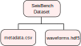

The SeisBench data format
=========================

Overview
-------------------------------------

SeisBench datasets consist of two key components: the metadata and the waveform traces.
This is reflected in the data format.
Each dataset consists of two file: a csv file storing the metadata and a `hdf5 file <https://www.hdfgroup.org/solutions/hdf5/>`__ for storing the actual waveform traces.
These files need to reside in the same folder and need to be named *metadata.csv* and *waveforms.hdf5*.

SeisBench implements a standard reader and a standard writer for this data format.
The standard reader is the class :py:class:`~seisbench.data.base.WaveformDataset`.
The standard writer is the class :py:class:`~seisbench.data.base.WaveformDataWriter`
Please consult their documentations for details on reading and writing the format.
Derived from the :py:class:`~seisbench.data.base.WaveformDataset`,
SeisBench offers a range of :doc:`benchmark datasets<benchmark_datasets>` in SeisBench format.

|

The metadata.csv is a comma separated ascii file, containing all describing information about the traces.
Each row corresponds to one trace.
Metadata is generally extensible, i.e., new datasets can introduce columns just by putting them into the csv.
A general :ref:`guide on metadata naming<metadata>` and known metadata parameters can be found below.
A special entry in the metadata table is the :ref:`split<splits>` column, which indicates data splitting, e.g., into train/dev/test.
As the metadata is stored in table-oriented format, the data is read in
and integrated with the high-level data analysis library `pandas <https://pandas.pydata.org/>`__
providing rapid filtering and general comparison functionality.

A key column in the metadata is the `trace_name`.
The trace name links the metadata row to the waveform trace in the hdf5 file.
Trace names can be any strings, but are not allowed to contain $ characters,
as they are used for building :ref:`trace blocks<trace_blocks>`.
Furthermore, we advice to use the / character with care, as it will be resolved as subgroup in the hdf5 file.
While this might be wanted in some cases, it should be used with care.

The hdf5 file should have two groups at root level: `data` and `data_format`.
The `data` group contains all the traces.
The trace corresponding to a metadata row is located at `data/[trace_name]` inside the hdf5 file.
The `data_format` group describes the format of the dataset and is described below.

The format has two extensions, :ref:`chunking<chunking>` and :ref:`trace blocks<trace_blocks>`.
Chunking can be used to split very large datasets semantically.
This makes the datasets easier to handle, for example when transferring between machines.
In contrast, trace blocks massively improve read and write performance of data sets.
They are advised even for medium sized datasets,
as otherwise limitations of the hdf5 format's performance will be visible.
Both extensions are described below.

.. _data_format:

The data format group
---------------------

The `data_format` group contains information about the content of the dataset.
It differs from the metadata, as it describes dataset level information in contrast to trace level information.
The data format group contains the following keys:

*  `dimension_order (required)`: The order of the dimensions in the arrays as string.
   For example, channels first then waveform samples would be denoted as "CW".
   A waveform with 3 channels and 1000 samples would then be stored in an array with shape (3, 1000).
   Common identifiers are C for channels, W for waveform samples and N for a sample axis,
   which is usually only added in SeisBench when combining multiple traces into one array.
   Further identifiers, for example I for instrument can be included,
   and later need to be passed to the constructor of :py:class:`~seisbench.data.base.WaveformDataset`.
   By default SeisBench uses "CW", respectively "NCW", which is consistent with the order of channels and samples in pytorch.
   Note that instead of a string also a list of identifiers can be used.

*  `component_order (required)`: The order of the components as a string.
   For example "ZNE" would denote vertical, north-south and east-west traces in that order.
   Similar to `dimension_order`, further letters can be introduced.
   Note that instead of a string also a list of identifiers can be used.

*  `sampling_rate (optional)`: The sampling rate in Hz.
   If the sampling rate is constant across the dataset, it is recommended to set it in the `data_format`.
   Otherwise, the columns `trace_sampling_rate_hz` or `trace_dt_s` can be used to indicate sampling rates for each trace.

*  `measurement (optional)`: The quantity measured, e.g., velocity or acceleration, as a string.
   This is purely informal and will not be parsed by SeisBench.
   However, it should be given as a quick information to the user.
   If different quantities where measured, they should be separated with a slash, e.g., "velocity/acceleration".
   In this case, the `station_channel` column in the metadata should indicate the type of measurements.

*  `unit (optional)`: The measurement unit, e.g., mps for meters per second.
   For multiple quantities measures, again the slash should be used.
   It is highly adviced not to mix different units for the same quantity within one dataset, e.g., do not mix `mps` and `cmps`.

*  `instrument_response (optional)`: Information if the instrument response was restituted.
   Common values are "not restituted" or "restituted".
   The string should be self-descriptive.

.. note::
    Please note that `dimension_order` and `component_order` are required,
    because they allow SeisBench to automatically return waveforms in the data format specified
    in the constructor of :py:class:`~seisbench.data.base.WaveformDataset` or the SeisBench config.

    `sampling_rate` should be specified to enable automatic trace resampling,
    but as mentioned above can also be specified through the metadata.

    The remaining entries in the data_format group are not parsed by SeisBench, but are intended as hints for users.

.. _splits:

Splits
-------

The splits are indicated through the `split` column in the metadata.
They should usually take the values `train`, `dev`, `test`.
However, any split identifier can be used, for example to define splits for cross validation.
As splitting can have major impact on the performance of machine learning algorithms,
we strongly recommend to define splits in your dataset.
This way, comparability across different studies can be improved.
The :py:class:`~seisbench.data.base.WaveformDataset` implements convenience methods for
selecting the different splits of the dataset.

When defining splits, consider how the splits should be chosen to give a realistic image of the performance.
For example, it might be advisable to put all traces belonging to a certain event into the same split,
or even use assign events withing a certain period of time to the same split.
As splitting will strongly depend on the dataset at hand, we recommend dataset authors to carefully consider this point.

.. _trace_blocks:

Traces blocks
------------------

The SeisBench format offers trace blocks to alleviate performance limitations in hdf5 when reading and writing many small array.
The key idea of trace blocks is to pack traces for multiple rows of the metadata into a single array in hdf5.
This makes reading and writing faster, in particular for sequential reads.
We recommend using trace blocks already for medium sized data sets (>10,000 traces).
However, they are optional and SeisBench can read both formats, with and without trace blocks, natively.

To achieve this, the function of the `trace_name` is modified.
A trace name with blocks has the structure `[blockname]$[slice]`, e.g. "block1$1,:5".
`blockname` can be an arbitrary string, as long as it does not contain a $ character.
Note that, similar to regular trace names, / characters in the block name will be interpreted as subgroups in hdf5.
The slice denotes the position of the trace inside the block.
It is given as a string in python slice notation as used for numpy, e.g., "1,:5",
would address the first five elements of the second (zero-based) element in the array.
Note that, as for numpy, it is valid to only specify the required dimensions.
For example for a 4D-Array, the terms "1,:5,:,:" and "1,:5" would be considered identical.
This addressing allows both to define the position of the trace in the block and to remove potential padding
from packing traces of different length into the same plot.

The key advantage is that they are faster when reading multiple entries from the same block than reading the same from a dataset without blocks.
Gains are considerably smaller when accessing only single traces from each block.
This leads to some points that should be considered when designing trace blocks.
First, traces that are often read together should be in the same block.
For example, trace blocks should approximately follow the order of the rows in the metadata,
meaning adjacent rows should have the same block if possible.
Similarly, train/dev/test should not share blocks, as a common use case will be to load only one of these sets.
Second, blocks should contain traces of similar length.
This reduces the amount of padding and thereby waste of disk space and memory.

The :py:class:`~seisbench.data.base.WaveformDataWriter` by default writes trace blocks.
See the documentation for further details on the strategy employed.

.. _chunking:

Chunking datasets
-----------------

The SeisBench format offers chunking of datasets to split very large datasets (> 50 GB) into multiple files.
This can make moving datasets between machines easier.
Chunking can be combined with trace blocks.
Instead of one metadata.csv and one waveforms.hdf5 file, a chunked data set consists of multiple chunks.
Each chunk has one `metadata[chunk].csv` and `waveforms[chunk].hdf5` file.
Chunks can have arbitrary non-empty names, but the user should make sure they are interoperable between file systems.
The :ref:`data_format<data_format>` needs to be specified in each chunk and needs to be identical in each chunk.
This also implies, that each chunk is a valid dataset in itself (up to the names of the files).

There are two way of specifying the chunks contained in a dataset.
First, and highly recommended, a simple ascii file called `chunks` can be added to the directory of the dataset.
This file contains the names of the chunks separated by linebreaks.
Second, if no chunks file is available, chunks are derived from the file names.
This is not advised, as in contrast to the first option, this option does not allow to detect incomplete datasets.

In contrast to trace blocks, chunks will usually have no impact on read and write performance.
Still, it is recommended to separate chunks semantically, for example, create one chunk for each year of data.
The :py:class:`~seisbench.data.base.WaveformDataset` can read chunked files, both with and without a chunks file.
The :py:class:`~seisbench.data.base.WaveformDataWriter` does not implement chunking in itself, but can easily be used for chunking.
To do so, pass the appropriate file names to the constructor and create on writer instance for each chunk.
In addition, write a chunks file indicating all existing chunks.

.. _metadata:

Metadata naming schema
-----------------------
When building custom datasets, metadata columns should conform to the following general naming schema:

    ``CATEGORY_PARAMETER_UNIT``.

The ``CATEGORY`` defines which object the parameter describes.

The categories are **trace**, **source**, **station** and **path**.

- :ref:`trace<trace>` contains all information and annotations for the trace, such as the start time, the picks or ground motion parameters.
- :ref:`source<source>` describes the source of the waves, such as an earthquake. Source parameters will be empty for noise traces.
  All rows with the same `source_id` should agree in all source parameters.
- :ref:`station<station>` contains all information about the station recording the trace, such as station and network code or station location.
- :ref:`path<path>` is used for all properties of the propagation path, such as travel times or distances.

The ``PARAMETER`` describes the provided information, e.g., `latitude` or `longitude`.
Parameter names should be as self-contained as possible.

The ``UNIT`` defines the unit in which the information is provided.
Example unit identifiers would be `m`, `cm`, `s`, `counts` or `samples`.
For division in units use `p`, for example `mps` for meters per second or `mps2` for meter per second squared.
The unit should only be omitted if the parameter is unit-less, such as for trace ids or station codes.

All names should be in snake case, i.e., lowercase and using underscores as separators.
Exceptions regarding capitalization can be made where common, e.g., seismometer components, units, wave phases.

.. note::
    Please note that not every dataset needs to integrate all of the metadata columns!
    The only strictly required column is `trace_name` as it is used for referencing the trace in the hdf5 data file.

.. _trace:

Trace parameters
-----------------

+-------------------------------+------------------------------------------------------------------------------------------------------------------------+
| Parameter name                | Comment                                                                                                                |
+===============================+========================================================================================================================+
| trace_name                    | A unique identifier for the trace.                                                                                     |
+-------------------------------+------------------------------------------------------------------------------------------------------------------------+
| trace_start_time              | If possible following ISO 8601:2004.                                                                                   |
+-------------------------------+------------------------------------------------------------------------------------------------------------------------+
| trace_sampling_rate_hz        | Sampling rate of the trace. If sampling rate is constant across all traces in the data set,                            |
|                               | it can also be specified in the `data_format` group in the hdf5 data file.                                             |
+-------------------------------+------------------------------------------------------------------------------------------------------------------------+
| trace_dt_s                    | Time difference between two samples. Will be ignored if sampling rate is provided.                                     |
+-------------------------------+------------------------------------------------------------------------------------------------------------------------+
| trace_npts                    | Number of samples in the trace.                                                                                        |
+-------------------------------+------------------------------------------------------------------------------------------------------------------------+
| trace_channel                 | Channel from which the data was obtained without the component identifier, e.g., `HH`, `HN`, `BH`.                     |
|                               | If you're planning to build a dataset with multiple channels for each trace, please get in touch with the developers.  |
+-------------------------------+------------------------------------------------------------------------------------------------------------------------+
| trace_category                | e.g. earthquake, noise, mine blast.                                                                                    |
+-------------------------------+------------------------------------------------------------------------------------------------------------------------+
| trace_p_arrival_sample        | Sample in trace at which P-phase arrives.                                                                              |
+-------------------------------+------------------------------------------------------------------------------------------------------------------------+
| trace_p_status                | e.g. manual/automatic.                                                                                                 |
+-------------------------------+------------------------------------------------------------------------------------------------------------------------+
| trace_p_weight                | Weighting factor assigned to P-phase pick.                                                                             |
+-------------------------------+------------------------------------------------------------------------------------------------------------------------+
| trace_p_uncertainty_s         | Uncertainty of P-phase pick in seconds.                                                                                |
+-------------------------------+------------------------------------------------------------------------------------------------------------------------+
| trace_s_arrival_sample        | Sample in trace at which S-phase arrives.                                                                              |
+-------------------------------+------------------------------------------------------------------------------------------------------------------------+
| trace_s_status                | e.g. manual/automatic.                                                                                                 |
+-------------------------------+------------------------------------------------------------------------------------------------------------------------+
| trace_s_weight                | Weighting factor assigned to S-phase pick.                                                                             |
+-------------------------------+------------------------------------------------------------------------------------------------------------------------+
| trace_s_uncertainty_s         | Uncertainty of S-phase pick in seconds.                                                                                |
+-------------------------------+------------------------------------------------------------------------------------------------------------------------+
| trace_polarity                |                                                                                                                        |
+-------------------------------+------------------------------------------------------------------------------------------------------------------------+
| trace_coda_end_sample         | Total no. of samples in trace.                                                                                         |
+-------------------------------+------------------------------------------------------------------------------------------------------------------------+
| trace_snr_db                  | Signal-to-noise ratio of trace in decibels.                                                                            |
+-------------------------------+------------------------------------------------------------------------------------------------------------------------+
| trace_Z_snr_db                | SNR on the Z component in decibels, similar for other components.                                                      |
+-------------------------------+------------------------------------------------------------------------------------------------------------------------+
| trace_completeness            | Fraction of samples in the trace, which were not filled with placeholder values (between 0 and 1).                     |
|                               | Placeholder values occure for example in case of recording gaps or missing component traces.                           |
+-------------------------------+------------------------------------------------------------------------------------------------------------------------+
| trace_pga_perg                | PGA in precent g on the horizontal components.                                                                         |
+-------------------------------+------------------------------------------------------------------------------------------------------------------------+
| trace_pga_cmps2               | PGA in cm / s ** 2 on the horizontal components.                                                                       |
+-------------------------------+------------------------------------------------------------------------------------------------------------------------+
| trace_Z_pga_cmps2             | PGA in cm / s ** 2 on the Z component. Similar for other components.                                                   |
+-------------------------------+------------------------------------------------------------------------------------------------------------------------+
| trace_pgv_cmps                | PGV in cm / s on the horizontal components.                                                                            |
+-------------------------------+------------------------------------------------------------------------------------------------------------------------+
| trace_Z_pgv_cmps              | PGV in cm / s on the Z component. Similar for other components.                                                        |
+-------------------------------+------------------------------------------------------------------------------------------------------------------------+
| trace_E_sa0.3s_perg           | Spectral acceleration at t=0.3s in percent g.                                                                          |
+-------------------------------+------------------------------------------------------------------------------------------------------------------------+
| trace_pga_time                | If possible following ISO 8601:2004. Similar for components.                                                           |
+-------------------------------+------------------------------------------------------------------------------------------------------------------------+
| trace_Z_median_counts         |                                                                                                                        |
+-------------------------------+------------------------------------------------------------------------------------------------------------------------+
| trace_Z_mean_counts           |                                                                                                                        |
+-------------------------------+------------------------------------------------------------------------------------------------------------------------+
| trace_Z_rms_counts            |                                                                                                                        |
+-------------------------------+------------------------------------------------------------------------------------------------------------------------+
| trace_Z_min_counts            |                                                                                                                        |
+-------------------------------+------------------------------------------------------------------------------------------------------------------------+
| trace_Z_max_counts            |                                                                                                                        |
+-------------------------------+------------------------------------------------------------------------------------------------------------------------+
| trace_Z_lower_quartile_counts |                                                                                                                        |
+-------------------------------+------------------------------------------------------------------------------------------------------------------------+
| trace_Z_upper_quartile_counts |                                                                                                                        |
+-------------------------------+------------------------------------------------------------------------------------------------------------------------+
| trace_Z_spikes                |                                                                                                                        |
+-------------------------------+------------------------------------------------------------------------------------------------------------------------+

.. _source:

Source parameters
--------------------

+-----------------------------------------+----------------------------------------------------------------------------------------------+
| Parameter name                          | Comment                                                                                      |
+=========================================+==============================================================================================+
| source_id                               | A unique identifier for the source trace.                                                    |
+-----------------------------------------+----------------------------------------------------------------------------------------------+
| source_origin_time                      | Origin time of source.                                                                       |
+-----------------------------------------+----------------------------------------------------------------------------------------------+
| source_origin_uncertainty_sec           | Uncertainty of source origin time in seconds.                                                |
+-----------------------------------------+----------------------------------------------------------------------------------------------+
| source_latitude_deg                     | Source latitude coordinate in degrees.                                                       |
+-----------------------------------------+----------------------------------------------------------------------------------------------+
| source_latitude_uncertainty_deg         | Uncertainty of source latitude coordinate in degrees.                                        |
+-----------------------------------------+----------------------------------------------------------------------------------------------+
| source_longitude_deg                    | Source longitude coordinate in degrees.                                                      |
+-----------------------------------------+----------------------------------------------------------------------------------------------+
| source_longitude_uncertainty_deg        |  Uncertainty of source longitude coordinate in degrees.                                      |
+-----------------------------------------+----------------------------------------------------------------------------------------------+
| source_error_sec                        | Error association with source location. ??                                                   |
+-----------------------------------------+----------------------------------------------------------------------------------------------+
| source_gap_deg                          | Azimuthal gap from the source determination.                                                 |
+-----------------------------------------+----------------------------------------------------------------------------------------------+
| source_horizontal_uncertainty_km        | Epicentral uncertainity of source location in kilometers.                                    |
+-----------------------------------------+----------------------------------------------------------------------------------------------+
| source_depth_km                         | Source depth in kilometers.                                                                  |
+-----------------------------------------+----------------------------------------------------------------------------------------------+
| source_depth_uncertainty_km             | Uncertainty of source depth in kilometers.                                                   |
+-----------------------------------------+----------------------------------------------------------------------------------------------+
| source_magnitude                        | Magnitude value association with source.                                                     |
+-----------------------------------------+----------------------------------------------------------------------------------------------+
| source_magnitude_type                   | Type of magnitude caluculation used when assigning magnitude to source.                      |
+-----------------------------------------+----------------------------------------------------------------------------------------------+
| source_magnitude_author                 | Author of magnitude calculation.                                                             |
+-----------------------------------------+----------------------------------------------------------------------------------------------+
| source_focal_mechanism_t_azimuth        | Focal mechanism should be described using azimuth, plunge and length of                      |
|                                         | the three principal axis. While this might be less common than describing the fault plane,   |
|                                         | this allows to accurately describe non-double-couple focal mechanism.                        |
+-----------------------------------------+----------------------------------------------------------------------------------------------+
| source_focal_mechanism_t_plunge         |                                                                                              |
+-----------------------------------------+----------------------------------------------------------------------------------------------+
| source_focal_mechanism_t_length         |                                                                                              |
+-----------------------------------------+----------------------------------------------------------------------------------------------+
| source_focal_mechanism_p_azimuth        |                                                                                              |
+-----------------------------------------+----------------------------------------------------------------------------------------------+
| source_focal_mechanism_p_plunge         |                                                                                              |
+-----------------------------------------+----------------------------------------------------------------------------------------------+
| source_focal_mechanism_p_length         |                                                                                              |
+-----------------------------------------+----------------------------------------------------------------------------------------------+
| source_focal_mechanism_n_azimuth        |                                                                                              |
+-----------------------------------------+----------------------------------------------------------------------------------------------+
| source_focal_mechanism_n_plunge         |                                                                                              |
+-----------------------------------------+----------------------------------------------------------------------------------------------+
| source_focal_mechanism_n_length         |                                                                                              |
+-----------------------------------------+----------------------------------------------------------------------------------------------+
| source_focal_mechanism_eval_mode        |                                                                                              |
+-----------------------------------------+----------------------------------------------------------------------------------------------+
| source_focal_mechanism_scalar_moment_Nm |                                                                                              |
+-----------------------------------------+----------------------------------------------------------------------------------------------+

.. _station:

Station parameters
--------------------

+--------------------------------+--------------------------------------------+
| Parameter name                 | Comment                                    |
+================================+============================================+
| station_code                   | Instrument station code.                   |
+--------------------------------+--------------------------------------------+
| station_network_code           | Instrument network code.                   |
+--------------------------------+--------------------------------------------+
| station_location_code          | Instrument location code.                  |
+--------------------------------+--------------------------------------------+
| station_latitude_deg           | Instrument latitude in degrees.            |
+--------------------------------+--------------------------------------------+
| station_longitude_deg          | Instrument latitude in degrees.            |
+--------------------------------+--------------------------------------------+
| station_elevation_m            | Instrument latitude in m.                  |
+--------------------------------+--------------------------------------------+
| station_sensitivity_counts_spm | Instrument sensitivity in counts * s/m.    |
+--------------------------------+--------------------------------------------+

.. _path:

Path parameters
--------------------

+--------------------------------+---------------------------------------------------------------+
| Parameter name                 | Comment                                                       |
+================================+===============================================================+
| path_p_travel_s                | Travel-time for P-phase in seconds.                           |
+--------------------------------+---------------------------------------------------------------+
| path_p_residual_s              | Residual of P-phase against some prediction in seconds        |
+--------------------------------+---------------------------------------------------------------+
| path_weight_phase_location_p   | Weight assigned to P-phase in location procedure in seconds.  |
+--------------------------------+---------------------------------------------------------------+
| path_s_travel_s                | Travel-time for S-phase in seconds.                           |
+--------------------------------+---------------------------------------------------------------+
| path_s_residual_s              |Residual of P-phase against some prediction in seconds.        |
+--------------------------------+---------------------------------------------------------------+
| path_weight_phase_location_s   | Weight assigned to P-phase in location procedure in seconds.  |
+--------------------------------+---------------------------------------------------------------+
| path_azimuth_deg               | Azimuth of phase path from source to reciever in degrees.     |
+--------------------------------+---------------------------------------------------------------+
| path_back_azimuth_deg          | Backazimuth of phase path from source to reciever in degrees. |
+--------------------------------+---------------------------------------------------------------+
| path_ep_distance_km            | Epicentral distance of source reciever path in kilometers.    |
+--------------------------------+---------------------------------------------------------------+
| path_hyp_distance_km           | Hypocentral distance of source reciever path in kilometers.   |
+--------------------------------+---------------------------------------------------------------+

